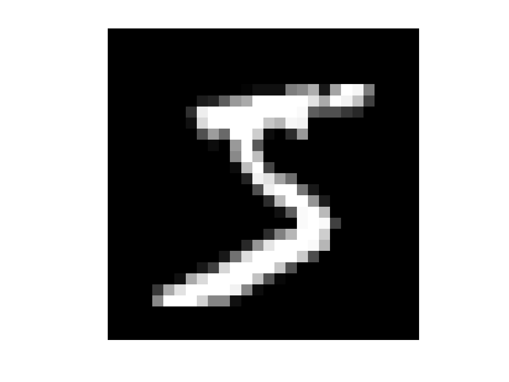

# Bài 1: 
## Xây dựng một mô hình Machine learning (not deep learning) ứng dụng cho bài phân biệt loại ký tự quang học, ứng dụng data MNIST. Chỉ sử dụng numpy.
### Down load dataset của Mnist [tại đây](https://www.kaggle.com/datasets/hojjatk/mnist-dataset/data)

Dùng thuật toán KNN cho bài toán phân loại với data Mnist.

|Data|Image|Label|
|----|----|----|
|Train|50000|50000|
|Test|10000|10000|

Test ảnh bên ngoài:

**predict label is: 5**
***

# Bài 2: Triplet loss
##  a. Viết công thức toán, implement (code numpy) và giải thích về Triplet loss.
 ##

### Triplet Loss được sử dụng để học một không gian nhúng (embedding space) sao cho khoảng cách giữa một điểm anchor và một điểm positive (cùng lớp) nhỏ hơn khoảng cách giữa điểm anchor và một điểm negative (khác lớp) với một biên độ margin nhất định.

**Công thức Triplet Loss**

**$\[ L(a, p, n) = \max(0, \|f(a) - f(p)\|^2 - \|f(a) - f(n)\|^2 + \alpha) \]$**

Trong đó:

- $\( L(a, p, n) \)$: Giá trị Triplet Loss.
- $\( a \)$: Vector đặc trưng của điểm anchor.
- $\( p \)$: Vector đặc trưng của điểm positive.
- $\( n \)$: Vector đặc trưng của điểm negative.
- $\( \|f(a) - f(p)\|^2 \)$: Khoảng cách Euclidean bình phương giữa vector đặc trưng của anchor và positive.
- $\( \|f(a) - f(n)\|^2 \)$: Khoảng cách Euclidean bình phương giữa vector đặc trưng của anchor và negative.
- $\( \alpha \)$: Margin (biên độ) để đảm bảo rằng khoảng cách giữa anchor và positive phải nhỏ hơn khoảng cách giữa anchor và negative một lượng ít nhất là \(\alpha\).

Công thức này đảm bảo rằng các mẫu cùng lớp sẽ gần nhau hơn trong không gian nhúng, trong khi các mẫu khác lớp sẽ cách xa nhau một khoảng cách tối thiểu.

## b. Viết công thức toán, implement (code numpy) và giải thích khi Input triplet loss mở rộng không chỉ là 1 mẫu thật và một mẫu giả nữa mà sẽ là 2 mẫu thật và 5 mẫu giả.
# Triplet Loss Mở Rộng

Triplet Loss được sử dụng để học một không gian nhúng (embedding space) sao cho khoảng cách giữa một điểm anchor và một điểm positive (cùng lớp) nhỏ hơn khoảng cách giữa điểm anchor và một điểm negative (khác lớp) với một biên độ margin nhất định. Trong trường hợp mở rộng, chúng ta có nhiều hơn một mẫu positive và nhiều hơn một mẫu negative.

**Công thức Triplet Loss Mở Rộng**

**$\[ L(a, P, N) = \sum_{p \in P} \sum_{n \in N} \max(0, \|f(a) - f(p)\|^2 - \|f(a) - f(n)\|^2 + \alpha) \]$**

Trong đó:

- $\( L(a, P, N) \)$: Giá trị Triplet Loss.
- $\( a \)$: Vector đặc trưng của điểm anchor.
- $\( P \)$: Tập hợp các vector đặc trưng của các điểm positive.
- $\( N \)$: Tập hợp các vector đặc trưng của các điểm negative.
- $\( \|f(a) - f(p)\|^2 \)$: Khoảng cách Euclidean bình phương giữa vector đặc trưng của anchor và một positive bất kỳ trong tập \( P \).
- $\( \|f(a) - f(n)\|^2 \)$: Khoảng cách Euclidean bình phương giữa vector đặc trưng của anchor và một negative bất kỳ trong tập \( N \).
- $\( \alpha \)$: Margin (biên độ) để đảm bảo rằng khoảng cách giữa anchor và positive phải nhỏ hơn khoảng cách giữa anchor và negative một lượng ít nhất là \(\alpha\).

Công thức này đảm bảo rằng các mẫu cùng lớp sẽ gần nhau hơn trong không gian nhúng, trong khi các mẫu khác lớp sẽ cách xa nhau một khoảng cách tối thiểu.

***
#   Bài 3:

## Xây dựng một mô hình Deep Learning ứng dụng cho bài phân biệt loại ký tự quang học, ứng dụng data MNIST. Chỉ sử dụng numpy, chỉ sử dụng Triplet loss
## Giải thích cách tiếp cận và phân tích lợi và hại so với phương pháp sử dụng Machine learning
### 1. Cách tiếp cận triplet loss
Triplet Loss là một hàm mất mát được sử dụng trong các bài toán học máy với mục tiêu tạo ra các nhúng (embeddings) cho dữ liệu sao cho các điểm nhúng của cùng một lớp gần nhau hơn so với các điểm nhúng của các lớp khác. Đây là một kỹ thuật thường được sử dụng trong các bài toán nhận diện và phân loại, đặc biệt là khi có sự khác biệt giữa các lớp nhỏ hoặc các lớp có số lượng mẫu không đều.

-Đào tạo với Triplets: Đối với mỗi mẫu dữ liệu (anchor), chọn một mẫu cùng lớp (positive) và một mẫu khác lớp (negative). Mục tiêu là làm cho khoảng cách giữa anchor và positive nhỏ hơn khoảng cách giữa anchor và negative một cách tối thiểu.

### 2. Ưu điểm và Nhược Điểm so với Phương Pháp Machine Learning Truyền Thống

**Ưu điểm**

-Chất lượng Nhúng Cao hơn
-Khả năng Xử lý Dữ liệu không cân bằng
-Độ Chính xác Cao hơn trong Nhận diện

**Nhược điểm**

-Yêu cầu Nhiều Dữ liệu Huấn luyện
-Chi phí Tính toán Cao hơn
-Phức tạp trong Triển Khai
 
***Triplet Loss cung cấp một cách tiếp cận mạnh mẽ cho các bài toán nhận diện và phân loại, đặc biệt là khi làm việc với dữ liệu không cân bằng hoặc phức tạp. Phương pháp truyền thống có thể là lựa chọn tốt hơn cho các bài toán phân loại cơ bản hoặc khi tài nguyên tính toán và dữ liệu bị hạn chế.***

